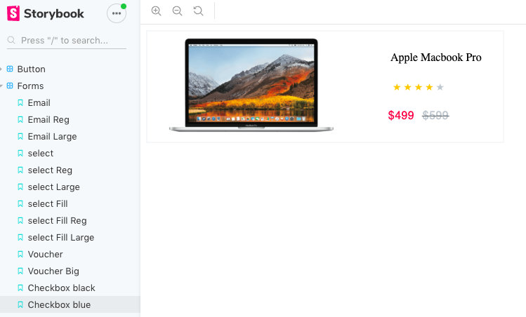

# A Storybook component library

## Description

Through research, I discovered that component Libraries are one of the huge advantages of working with React and a crucial part of building applications with React. I was able to build out this componet library using storybook and of course React! The components were replicated from mockups powered by adobe xd. Some of the components include buttons, forms, and thumbnails.

## Technologies:
* Adobe XD
* React
* Storybook
* VS code

## Required Installations:
* Fork and clone (or just clone) the repository
    * `git clone https://github.com/cenwachukwu/A-Component-Library`
    * cd into the directory
* Inside the directory install the dependencies:
    * `npm install`
    * `npm install @storybook/react --save-dev`
* To open the code in vs code, run code .
* To run this storybook, enter the following command in your terminal: npm run storybook